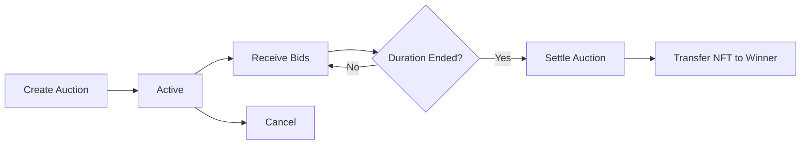

The Auction module implements English auction functionality for NFT sales with competitive bidding.

## Overview

The Auction module provides:

- **Create English auctions** - Time-bound auctions with starting bids
- **Place bids** - Submit competitive bids on active auctions
- **Cancel auctions** - Remove auctions before completion
- **Query auctions** - Get active auctions and auction history
- **Settle auctions** - Finalize auction and transfer NFT to winner

## API Reference

### Create English Auction

Start a new auction for an NFT with a starting bid and duration.

```typescript
const { auctionId, tx } = await sdk.auction.createEnglishAuction({
  collectionAddress: '0x...',
  tokenId: '1',
  startingBid: '1.0',
  duration: 86400 * 7,  // 7 days in seconds
});
```

**Parameters:**

| Field | Type | Description |
|-------|------|-------------|
| `collectionAddress` | `string` | NFT contract address |
| `tokenId` | `string` | Token ID to auction |
| `startingBid` | `string` | Minimum bid in ETH |
| `duration` | `number` | Auction duration in seconds |

**Returns:**

```typescript
{
  auctionId: string;  // Unique auction identifier
  tx: TransactionResponse;
}
```

### Place Bid

Submit a bid on an active auction.

```typescript
const { tx } = await sdk.auction.placeBid({
  auctionId: '1',
  amount: '1.5',
});
```

**Parameters:**

| Field | Type | Description |
|-------|------|-------------|
| `auctionId` | `string` | Auction to bid on |
| `amount` | `string` | Bid amount in ETH |

**Bid Requirements:**
- Must be higher than current highest bid
- Must exceed starting bid if first bid
- Typically requires 5-10% minimum increment

### Cancel Auction

Cancel an active auction (new in v1.1.4).

```typescript
const { tx } = await sdk.auction.cancelAuction('auctionId');
```

**Parameters:**

| Parameter | Type | Description |
|-----------|------|-------------|
| `auctionId` | `string` | Auction to cancel |

**Conditions:**
- Only auction creator can cancel
- Must have no bids (or based on contract rules)
- Auction must still be active

### Get Active Auctions

Query all active auctions with pagination (new in v1.1.4).

```typescript
const { items, total } = await sdk.auction.getActiveAuctions(
  1,   // Page number
  20   // Items per page
);
```

**Returns:**

```typescript
{
  items: Auction[];
  total: number;
}

interface Auction {
  id: string;
  seller: string;
  collectionAddress: string;
  tokenId: string;
  startingBid: string;
  currentBid: string;
  highestBidder: string;
  endsAt: number;
  status: 'active' | 'settled' | 'cancelled';
}
```

### Get Auctions by Seller

Get all auctions created by a specific seller (new in v1.1.4).

```typescript
const { items } = await sdk.auction.getAuctionsBySeller(
  '0xSellerAddress...',
  1,   // Page
  20   // Limit
);
```

## React Hooks

Use the `useAuction` hook for React integration:

```tsx
import { useAuction } from 'zuno-marketplace-sdk/react';

function AuctionComponent() {
  const {
    createEnglishAuction,
    placeBid,
    cancelAuction
  } = useAuction();

  const handleCreateAuction = async () => {
    const { auctionId, tx } = await createEnglishAuction.mutateAsync({
      collectionAddress: '0x...',
      tokenId: '1',
      startingBid: '1.0',
      duration: 86400 * 7,
    });

    console.log('Auction created:', auctionId);
    await tx.wait();
  };

  const handlePlaceBid = async () => {
    const { tx } = await placeBid.mutateAsync({
      auctionId: '1',
      amount: '1.5',
    });

    await tx.wait();
  };

  return (
    <div>
      <button onClick={handleCreateAuction}>Create Auction</button>
      <button onClick={handlePlaceBid}>Place Bid</button>
    </div>
  );
}
```

## Complete Example

```typescript
import { ZunoSDK } from 'zuno-marketplace-sdk';

const sdk = new ZunoSDK({
  apiKey: 'your-api-key',
  network: 'sepolia',
});

async function runAuction() {
  // Step 1: Create auction
  const { auctionId, tx: createTx } =
    await sdk.auction.createEnglishAuction({
      collectionAddress: '0x1234...',
      tokenId: '42',
      startingBid: '1.0',
      duration: 86400 * 3,  // 3 days
    });

  await createTx.wait();
  console.log('Auction created:', auctionId);

  // Step 2: Place bid
  const { tx: bidTx } = await sdk.auction.placeBid({
    auctionId,
    amount: '1.2',
  });

  await bidTx.wait();
  console.log('Bid placed successfully');

  // Step 3: Query active auctions
  const { items } = await sdk.auction.getActiveAuctions(1, 20);
  console.log(`Found ${items.length} active auctions`);

  // Step 4: Cancel if needed (before any bids)
  // const { tx: cancelTx } = await sdk.auction.cancelAuction(auctionId);
  // await cancelTx.wait();
}

runAuction();
```

## Auction Lifecycle



## Error Handling

```typescript
try {
  await sdk.auction.placeBid({
    auctionId: '1',
    amount: '1.5',
  });
} catch (error) {
  if (error.message.includes('Bid too low')) {
    console.error('Your bid must be higher than current bid');
  } else if (error.message.includes('Auction ended')) {
    console.error('This auction has already ended');
  } else if (error.code === 'INSUFFICIENT_FUNDS') {
    console.error('Insufficient balance for bid');
  } else {
    console.error('Bid failed:', error);
  }
}
```

## Best Practices

::alert{type="success"}
**Approve NFT before creating auction:**

```typescript
const approval = await nftContract.approve(
  AUCTION_CONTRACT_ADDRESS,
  tokenId
);
await approval.wait();
```
::

::alert{type="info"}
**Set minimum bid increment** - Most auctions require 5-10% increase:

```typescript
const currentBid = 1.0;
const minBid = currentBid * 1.1;  // 10% increment
```
::

::alert{type="warning"}
**Check auction end time** before bidding:

```typescript
const { items } = await sdk.auction.getActiveAuctions(1, 100);
const auction = items.find(a => a.id === auctionId);

if (auction.endsAt < Date.now() / 1000) {
  console.warn('Auction has ended');
}
```
::

## See Also

- **[Exchange Module](/sdk/core-modules/exchange)** - Fixed-price NFT sales
- **[Collection Module](/sdk/core-modules/collection)** - Create NFT collections
- **[Offers & Bundles](/sdk/core-modules/offers-bundles)** - Alternative sale methods
